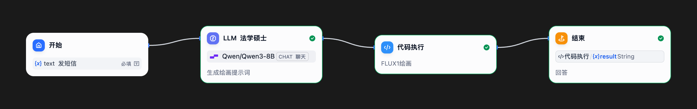
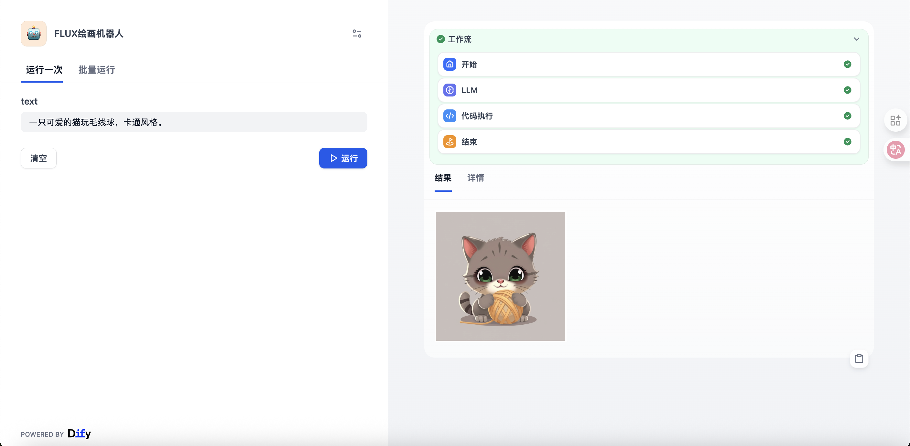

# FLUX 绘画机器人 (中文)

**Author:** `dugufeng`
**Tags:** `language:chinese`, `image-generation`, `flux`, `siliconflow`, `qwen`, `python`

这是一个 AI 绘画工作流。它接收用户的**中文**绘画需求，首先使用 Qwen-8B LLM 将其智能地转换为优化的**英文** Flux.1 绘画提示词，然后调用 Python 脚本和 SiliconFlow API (FLUX.1-schnell 模型) 来生成最终图像。

---

## 🛠️ 关键元数据 (Technical Details)

* **Dify Version:** `v1.9.0+` (Dugu Feng，请你测试并填写一个你认为兼容的最低版本)

---

## 🚀 关键前置条件 (Pre-conditions)

**1. SiliconFlow API 密钥:**
* 此工作流**强制**要求一个**硅基流动 (SiliconFlow)** 的 API 密钥。
* 你必须在 Dify 工作流的“变量” -> “环境变量”中配置这个 Key。

## 🚀 如何使用

1.  **【核心】设置环境变量:**
    * 在 Dify 工作流的“变量” -> “环境变量” (Environment Variables) 部分，点击“添加变量”。
    * **变量名称 (Name):** `apikey`
    * **变量值 (Value):** `sk-xxxxxxxx` (粘贴你从 SiliconFlow 获取的真实 API Key)

2.  **配置工具:**
    * 无需配置额外工具。此工作流已 100% 包含所有逻辑。

3.  **运行工作流:**
    * 在“开始”节点的 `text` 变量中输入你的**中文**绘画需求（例如：“一只猫在月亮上，赛博朋克风格”）。
    * 运行工作流，并在“结束”节点查看 `result`（即生成的图片）。

## 🛠️ 工作流节点 (Optional)

* **开始节点:** 接收用户的中文 `text` 输入。
* **LLM (生成提示词):** (使用 `Qwen/Qwen3-8B`) 将中文需求转换为优化的**英文** Flux.1 提示词。
* **代码执行 (FLUX1绘画):** (Python 脚本) 接收英文提示词和 `apikey`，调用 `black-forest-labs/FLUX.1-schnell` API 生成图片，并返回 Markdown 格式的图片链接。
* **结束节点:** 输出最终的 AI 绘画结果。

## 📸 运行截图 (Highly Recommended)

### 工作流图

### 运行示例
