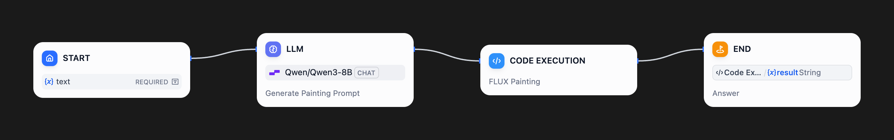
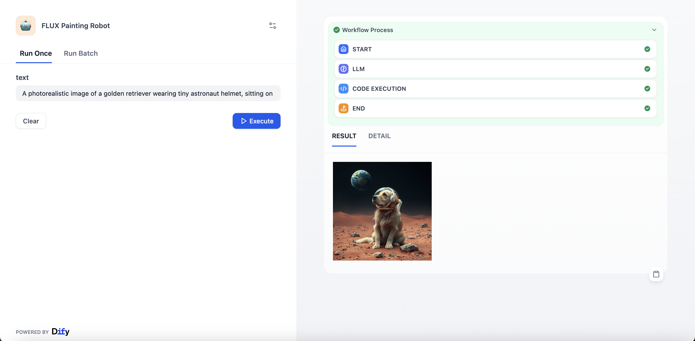

# FLUX Painting Robot (English)

**Author:** `dugufeng`
**Tags:** `language:english`, `image-generation`, `flux`, `siliconflow`, `qwen`, `python`

This is an AI painting workflow. It receives the user's **English** painting request, uses the Qwen-8B LLM to intelligently convert it into an optimized **English** Flux.1 painting prompt, and then calls a Python script and the SiliconFlow API (FLUX.1-schnell model) to generate the final image.

---

## 🛠️ 关键元数据 (Technical Details)

* **Dify Version:** `v1.9.0+` (Please fill in the Dify version you have tested)

---

## 🚀 关键前置条件 (Pre-conditions)

**1. SiliconFlow API Key:**
* This workflow **requires** a **SiliconFlow** API Key.
* You must configure this Key in your Dify workflow's "Variables" -> "Environment Variables".

## 🚀 如何使用

1.  **[CORE] Set Environment Variable:**
    * In your Dify workflow, navigate to "Variables" -> "Environment Variables" and click "Add Variable".
    * **Name:** `apikey`
    * **Value:** `sk-xxxxxxxx` (Paste your actual API Key from SiliconFlow)

2.  **Configure Tools:**
    * No other tools need configuration. This workflow is 100% self-contained.

3.  **Run the Workflow:**
    * In the "Start" node's `text` variable, enter your **English** painting request (e.g., "A cat on the moon, cyberpunk style").
    * Run the workflow and check the "End" node for the `result` (the generated image).

## 🛠️ 工作流节点 (Optional)

* **Start Node:** Receives the user's English `text` input.
* **LLM (Gen-Prompt):** (Uses `Qwen/Qwen3-8B`) Converts the English request into an optimized **English** Flux.1 prompt.
* **Code Execution (FLUX1-Painting):** (Python script) Receives the English prompt and `apikey`, calls the `black-forest-labs/FLUX.1-schnell` API to generate the image, and returns a Markdown-formatted image link.
* **End Node:** Outputs the final AI painting result.

## 📸 运行截图 (Highly Recommended)

### 工作流图

### 运行示例
